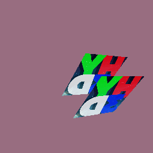
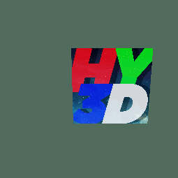
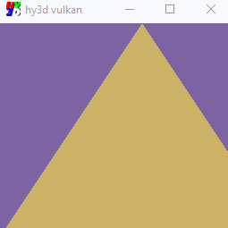
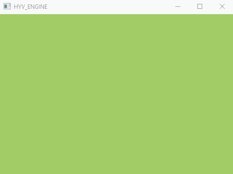

Just a dude learning Vulkan.

## Resources:

* https://hero.handmade.network/episode/code 
* https://www.khronos.org/registry/vulkan/specs/1.1/html/index.html
* https://vkguide.dev
* https://software.intel.com/content/www/us/en/develop/articles/api-without-secrets-introduction-to-vulkan-part-1.html
* https://vulkan-tutorial.com
* https://vulkan.lunarg.com/doc/sdk/1.2.154.1/windows/tutorial/html/index.html
* https://www.youtube.com/playlist?list=PL8327DO66nu9qYVKLDmdLW_84-yE4auCR
* https://www.youtube.com/playlist?list=PLUXvZMiAqNbK8jd7s52BIDtCbZnKNGp0P
* https://www.youtube.com/playlist?list=PLRtjMdoYXLf4A8013lsFWHOgM9qdh0kjH
* https://www.youtube.com/playlist?list=PL0JVLUVCkk-l7CWCn3-cdftR0oajugYvd
* the internet

## Progress (most recent first):
* 23/10/21:

  * Texture mipmaps
  * Multisample anti-aliasing
  * System to change msaa and other settings on runtime

* 21/10/21: 3D Model! (just obj for now)

* 19/10/21: Depth Buffer

* 19/10/21:

  * Stage multiple resources and push the into memory in a batch
  * Texture!

* 17/10/21:
  
  * Push mesh in gpu memory
  * Draw indexed triangles
  * Pass model, view and projection matrices in vertex shader.

* 12/10/21: Drawing a simple vertex buffer that I'm updating.

* 11/10/21: Shader code hotloading!

* 10/10/21: Triangle!

* 06/10/21: Engine code hotloading.

* 06/10/21: Just clearing the window to a color.

